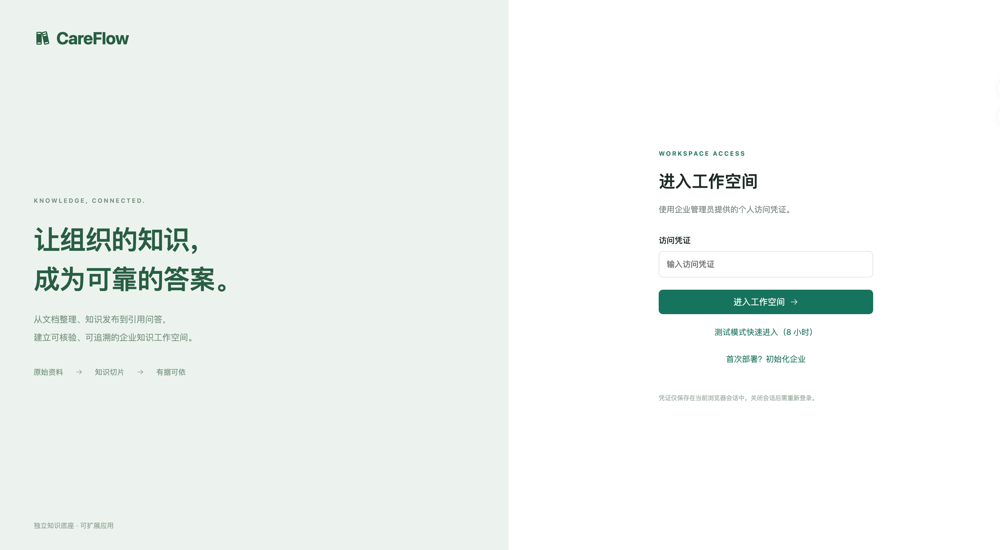
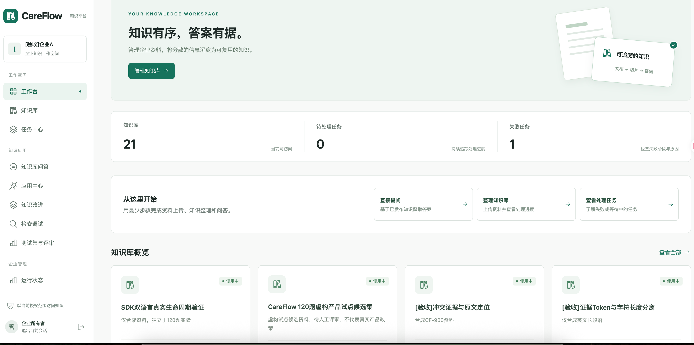
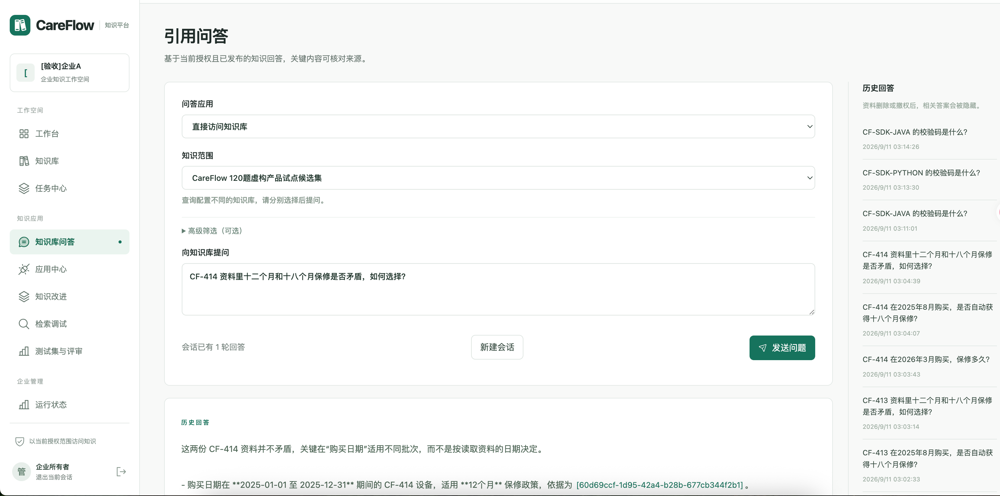
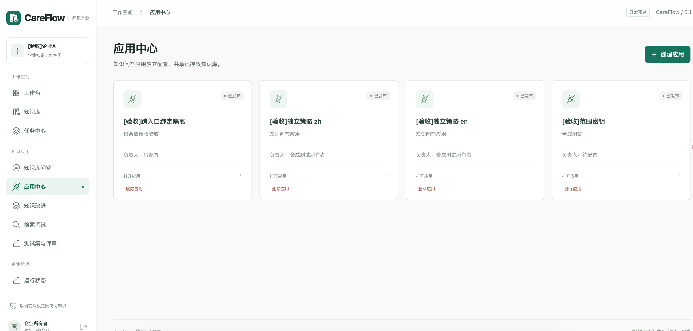
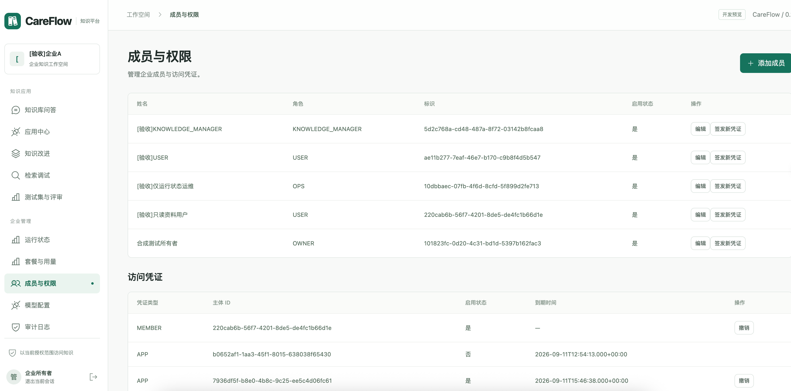

# CareFlow

CareFlow 是面向企业场景的开源知识库底座，采用“独立知识库底座 + 可扩展应用层”架构。系统负责文档生命周期、内容解析、检索、引用问答、权限隔离、应用接入和用量审计；业务意图识别、流程编排和 Agent 工具由上层应用配置与实现。

> 当前版本：`0.1.0` 开发增量。项目面向单机、低并发部署进行验证，优先保证功能正确、权限边界清晰和数据可追溯；不承诺高并发容量、高可用或生产 SLA。当前没有创建公开 Release、发布镜像或上传 SDK 包。

> **仓库状态：代码展示与内部维护。** 当前暂不接受外部 Pull Request、代码贡献或功能分支提交；后续开放计划以本文件和治理文档为准。

## 产品范围

CareFlow 的知识库底座包括：

- 企业、成员、角色、应用凭证和租户隔离；
- PDF、Office、Markdown、文本、表格及图片 OCR 导入；
- 文档版本、解析任务、可追溯切片、草稿修订和内容发布；
- Embedding、关键词 BM25、混合 RRF、Rerank 和类型化元数据过滤；
- 证据上下文、引用定位、流式问答、多轮会话、取消和断流状态；
- 用量、额度、成本核算、审计、任务恢复、备份和数据清理；
- Java 和 Python SDK，以及面向应用层的公共 API。

Web 端将问答统一为“知识库问答”入口：普通用户可直接提问，继续展开即可使用连续会话、历史回答、引用来源和反馈。知识库和应用均支持页面删除，删除前二次确认，删除后立即停止访问并进入后台清理。企业所有者和管理员还可以在“企业设置”中维护企业名称，变更使用乐观锁并保留审计记录。

通用 Agent 执行平台、视频转写、高并发推理、GPU 调度和 Kubernetes 高可用部署不属于当前版本的承诺范围。

## 为什么选择 CareFlow

如果需求只是“上传文件并进行问答”，成熟的托管知识库产品通常更省事。CareFlow 面向另一类场景：企业希望把知识能力作为自己的长期基础设施，掌握数据、权限、模型和集成边界。

- **数据自主可控**：部署在企业自己的环境，原始文件、索引、问答记录和审计数据由企业管理。
- **模型供应商可替换**：支持 DeepSeek、兼容 OpenAI 协议的服务和自托管模型，避免把知识流程绑定到单一供应商。
- **细粒度权限隔离**：按企业、成员、知识库、文档、应用和 API Key 复核访问范围；模型输出不能扩大权限。
- **完整知识生命周期**：从上传、解析、切片审核、索引、发布，到回滚、删除和物理清理，都有明确状态和审计记录。
- **可核验的回答**：答案关联文档版本、切片和来源位置，适合制度、产品、研发和合规资料。
- **可嵌入现有系统**：提供公共 API、Java SDK 和 Python SDK，可接入 OA、CRM、客服、内部门户和业务应用。
- **可持续扩展**：知识库底座与应用层分离，企业可以自行增加意图识别、流程编排和 Agent 工具。

CareFlow 的取舍也很明确：当前优先保证单机低并发下的功能正确、权限边界和可追溯性，不以通用 SaaS 的开箱即用、高并发容量或高可用 SLA 为目标。

## 界面预览

以下截图展示当前 Web 界面的主要操作路径。截图使用合成验收数据，仅用于说明交互和信息布局，不代表生产环境中的企业、人员或业务资料。

### 登录与工作台

<p align="center">
  
  
</p>

### 知识库问答与应用中心

<p align="center">
  
  
</p>

### 成员与访问凭证

<p align="center">
  
</p>

界面操作说明见[用户操作手册](docs/user-guide.md)，从文档上传、自动处理和发布到知识库问答的完整流程见[快速开始](docs/quickstart.md)。

## 架构

```text
Web / Java SDK / Python SDK
            │  公共 Java API
            ▼
Java Backend ── MySQL（身份、授权、元数据、任务、发布、计量）
      │
      ├── RabbitMQ（异步任务）
      ├── Object Storage（原始文件）
      └── Python Worker
             ├── 解析、OCR、Token 切片
             ├── Embedding / Rerank / Generation 适配
             └── Milvus（向量与关键词索引）
```

Java 拥有身份、授权、元数据、任务、发布和计量；Python 承担解析、模型和检索适配；Web 只调用公共 Java API。模型输出不授予权限，也不直接执行敏感业务动作。详细边界见[架构说明](docs/architecture.md)和[访问边界](docs/access-boundaries.md)。

## 快速开始

### 环境要求

- Docker Desktop 与 Docker Compose；
- Python 3（首次运行安装脚本生成 `.env` 时使用；已有 `.env` 可跳过）；
- 可用的 Embedding、Rerank 和 Generation 服务。

Java 21、Python 3.12 和 Node.js 22 仅在不使用容器、开发 SDK 或修改前端时需要。

### 启动服务

```bash
./scripts/install.sh
```

脚本会创建或保留 `.env`、构建本地镜像并启动全部服务。需要修改模型地址、名称或密钥时，编辑 `.env` 后重新创建对应服务；`.env` 不得提交到 Git。

打开 <http://localhost:5173>。首次进入时选择“初始化企业”，粘贴 `.env` 中的 `BOOTSTRAP_TOKEN`（已生成环境可运行 `python3 scripts/copy-bootstrap-token.py` 复制），填写企业名称并创建。创建成功后页面返回一次性所有者访问凭证，点击“进入工作空间”完成登录；该凭证应立即保存到密码管理器。若部署配置了 `DEFAULT_ACCESS_TOKEN`，它只能作为固定的临时登录便利方式，页面会提示其不安全，正式使用前应签发个人凭证并撤销默认凭证。完整安装范围和可选工具见[快速开始](docs/quickstart.md)。

完整的导入、索引、发布、检索和问答流程见[快速开始](docs/quickstart.md)；逐步人工验证上传到查询请参阅[人工验收流程](docs/manual-test-flow.md)。配置变量、密钥和模型版本规则见[配置参考](docs/configuration.md)。

## 模型配置

模型配置由 Java 管理并按版本冻结。Embedding、Rerank 和 Generation 必须分别配置；服务不可用、响应格式错误、维度不匹配或流中断时，系统显式失败，不返回模拟结果。

DeepSeek Generation 配置示例：

```text
GENERATION_BASE_URL=https://api.deepseek.com
GENERATION_MODEL=deepseek-v4-flash
GENERATION_API_KEY=<个人密钥>
```

密钥只允许放在服务端环境或受控密钥管理系统中，不得写入前端、日志、截图、Issue 或提交。Embedding 与 Rerank 需要独立配置；本机可以按[可选 CPU 模型服务](tools/local-models/README.md)部署固定版本的 BGE 模型。

模型配置和连通性排查见[配置参考](docs/configuration.md)与[故障排查](docs/troubleshooting.md)。

## API 与 SDK

Java API 默认地址为 <http://localhost:8080>，Swagger UI 为 <http://localhost:8080/swagger-ui/index.html>，OpenAPI 文件见 [`docs/openapi.json`](docs/openapi.json)。REST 前缀为 `/api/v1`，使用 Bearer 凭证认证。

- `POST /retrieval/search`：执行授权后的关键词、语义或混合检索；
- `POST /answers`：执行带引用的流式问答；
- POST 请求支持 `Idempotency-Key`，避免重复提交和重复计量；
- 无权访问的对象统一返回 404，不泄露对象是否存在；
- 客户端传入的 `tenant_id` 和 `user_id` 不参与可信授权。

Java 与 Python SDK 覆盖知识库、文档、任务、索引、发布、检索和流式问答。SDK 使用方式和兼容范围见 [`sdk/README.md`](sdk/README.md)。内部 Java–Python 协议见[内部协议](docs/internal-contracts.md)。

## 部署边界与已知限制

- 当前验证目标是 Linux/amd64 单机、低并发运行；
- 本地 CPU Rerank 适合开发和低并发使用，高并发请求可能返回模型忙碌或不可用错误；
- 数据库迁移按 Flyway 顺序执行，禁止修改已应用迁移；
- 删除先执行业务隔离，再由持久化清理任务处理文件、切片、缓存和索引；
- 恢复前必须核对备份、密钥、删除、撤权和成员状态，不确定时保持入口关闭；
- 当前版本仍有待完成的人工质量评审、安全审计及远端仓库保护核验。

部署、升级、恢复和故障处理见[部署说明](docs/production-deployment.md)、[运维手册](docs/operations.md)、[恢复手册](docs/recovery.md)和[故障排查](docs/troubleshooting.md)。

## 文档与参与方式

- [文档导航](docs/README.md)：按读者和主题索引全部文档；
- [扩展指南](docs/extension-guide.md)：解析器、模型适配器、检索策略和应用层扩展；
- [架构决策记录](docs/adr/)：重要设计取舍和兼容约束；
- [贡献指南](CONTRIBUTING.md)：内部开发、测试和评审约定；当前暂不接受外部贡献；
- [治理规则](GOVERNANCE.md)与[行为准则](CODE_OF_CONDUCT.md)：项目决策和社区协作；
- [安全政策](SECURITY.md)：漏洞私密报告渠道和处理范围；
- [变更记录](CHANGELOG.md)：版本变化与已知限制。

内部开发变更请先阅读 [AGENTS.md](AGENTS.md)、[质量标准](docs/quality.md)和[任务清单](docs/roadmap/v1.0-tasks.md)。

## 许可证

CareFlow 采用 [Apache License 2.0](LICENSE)。第三方依赖和分发声明见 [NOTICE](NOTICE)、[THIRD_PARTY.md](THIRD_PARTY.md)及 [`docs/licenses/`](docs/licenses/)。
